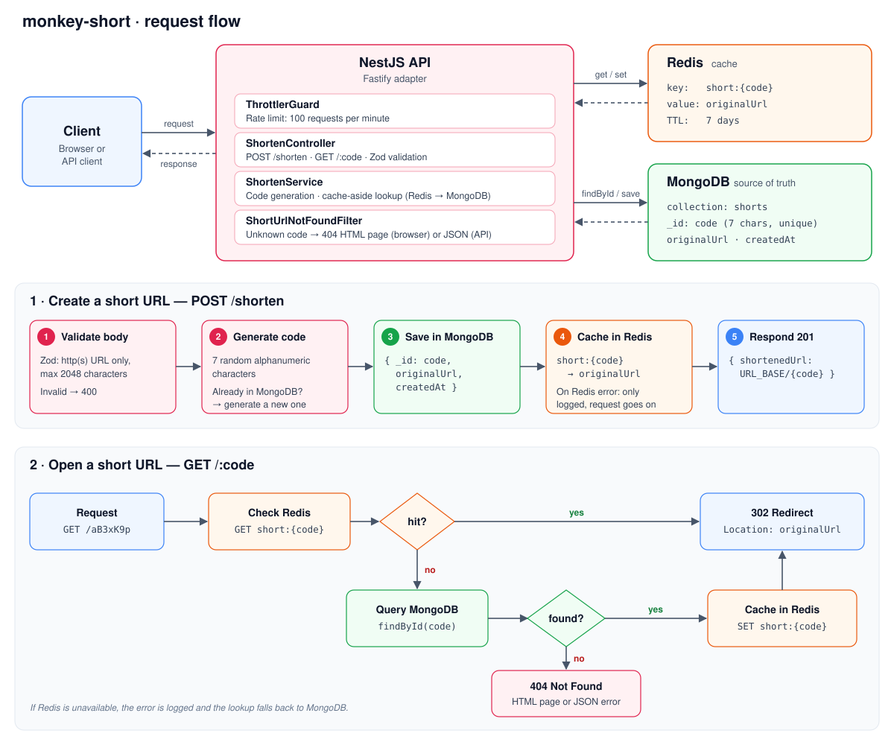

# URL Shortener

A simple URL shortener built for study and experimentation with **NestJS, MongoDB, and Redis**.

## Tech Stack

- NestJS
- MongoDB
- Redis
- TypeScript
- Next.js (frontend)

## Application Flow



## Routes

| Method | Route      | Description                                                                    |
| ------ | ---------- | ------------------------------------------------------------------------------ |
| `POST` | `/shorten` | Creates a short URL. Body: `{ "url": "https://..." }`                          |
| `GET`  | `/:code`   | Redirects (302) to the original URL                                            |
| `GET`  | `/:code`   | When the code doesn't exist: 404 page for browsers, JSON error for API clients |

> **Note:** the 404 page ([`not-found.html`](src/shorten/views/not-found.html)) and the whole frontend ([`web/`](web)) were made with AI.

## Frontend

The [`web/`](web) folder holds a small Next.js app that talks to the API: one field for the long URL, a button to shorten it and a field showing the short URL, plus usage instructions and a note about Render's cold starts.

It calls the API straight from the browser, using `NEXT_PUBLIC_API_URL` as the base URL (see [`web/.env.example`](web/.env.example)). The frontend's origin must be listed in the API's `CORS_ORIGINS`.

## Running Locally

```bash
docker compose up -d   # MongoDB and Redis
pnpm install
pnpm start:dev         # API on http://localhost:3000
```

In another terminal, for the frontend:

```bash
cd web
pnpm install
pnpm dev               # http://localhost:3001
```

Copy `.env.example` to `.env` (and `web/.env.example` to `web/.env.local`) and fill in the values first. For local use, set `CORS_ORIGINS=http://localhost:3001` in the API.

## Deployment

| Part     | Service       | Notes                                                                 |
| -------- | ------------- | --------------------------------------------------------------------- |
| API      | Render        | Built from the [`Dockerfile`](Dockerfile); free plan sleeps when idle |
| Frontend | Vercel        | Set the project's Root Directory to `web`                             |
| Database | MongoDB Atlas | Free M0 cluster                                                       |
| Cache    | Upstash Redis | Uses a `rediss://` (TLS) URI                                          |

Environment variables:

- **API (Render):** `NODE_ENV=production`, `URL_BASE` (the API's public URL), `CORS_ORIGINS` (the Vercel URL), `MONGODB_URI`, `REDIS_URI`, `OBSERVE_APP_KEY`, `OBSERVE_APP_SECRET`, `OBSERVE_SERVICE_ID`. Render sets `PORT` on its own.
- **Frontend (Vercel):** `NEXT_PUBLIC_API_URL` (the API's public URL).

## Security Checklist

- [x] CORS configuration
- [x] Rate limiting
- [x] DTO input validation
- [x] URL validation (HTTP/HTTPS only)
- [x] Random short code generation
- [x] Unique MongoDB index for short codes
- [x] Redis cache with TTL

## Core Features

- [x] Create shortened URLs
- [x] Redirect using short codes
- [x] Redis caching
- [x] MongoDB persistence
